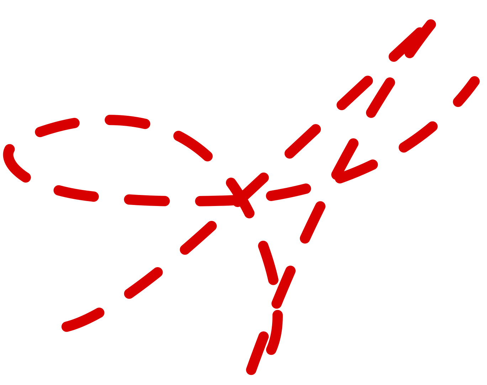

  <!-- Cool Pixel Art Animation -->
  

## Hi, I'm Ahmad Dumirieh ✨

Enthusiastic about healthcare and technology. As a medical professional, I bring a highly structured, analytical approach to software development. 

Currently, I'm heavily exploring **vibe coding**—seamlessly orchestrating AI agents like **Claude**, **Antigravity**, and **Codex** to build elegant and scalable solutions.

 

### ✦ Currently working on
- Deepening medical knowledge & advancing healthcare (USMLE prep)
- **Vibe coding** with AI for rapid iteration
- Building elegant full-stack solutions

 

### ✦ Tech Stack

  

### ✦ Connect

 

